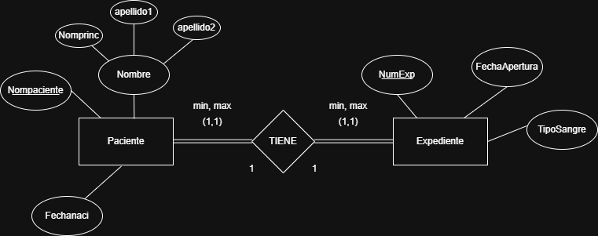
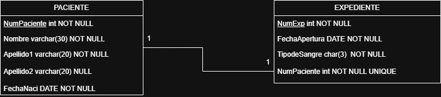
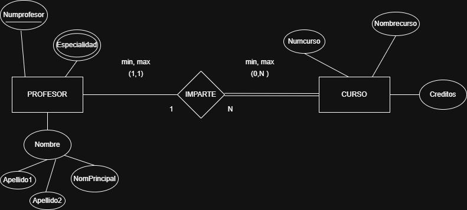
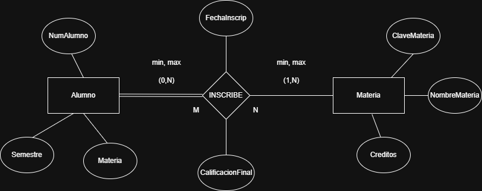
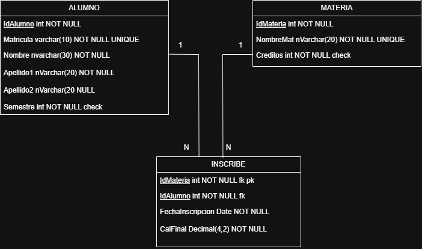
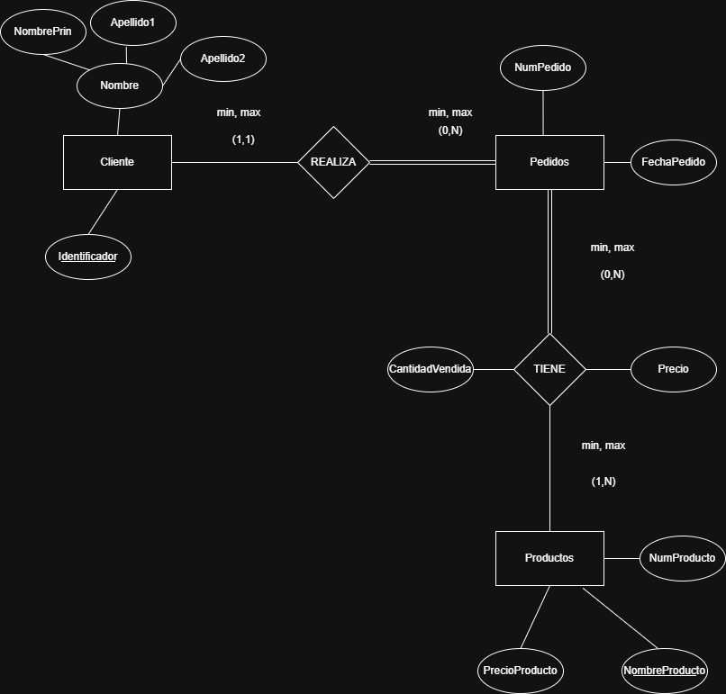
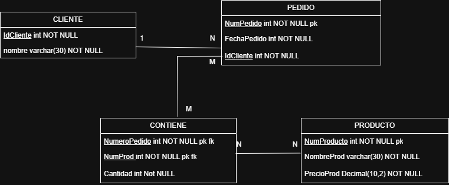

## EJERCICIOS RELACIONALES
 
## Ejercicio 1

- Entidad relcion  

- Relacional  

  

## Ejercicio 2
- Entidad relcion  

- Relacional 

  

## Ejercicio 3
- Entidad relcion  
  
- Relacional 

  

## Ejercicio 4
- Entidad relcion 
 
- Relacional 

  

## Ejercicio 5
- Entidad relcion 
 
 - Relacional 

  

## Ejercicio 6
- Entidad relcion 
 
  - Relacional 

  

## Ejercicio 7
 - Relacional 
