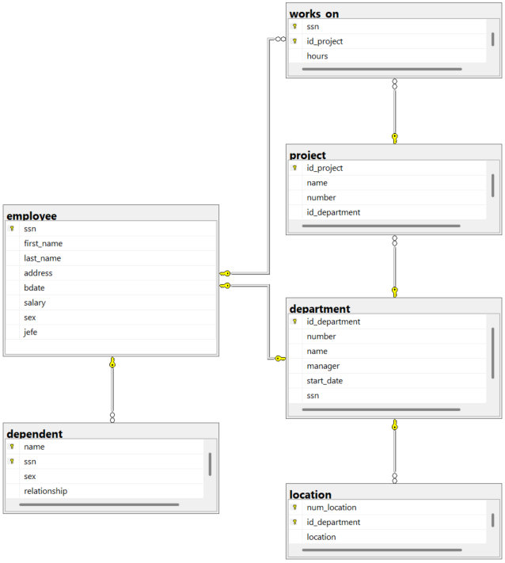

##CODIGO
```
CREATE DATABASE empresa;
GO

USE empresa;
GO

CREATE TABLE employee(
ssn INT NOT NULL,
first_name VARCHAR (30) NOT NULL,
last_name VARCHAR (30) NOT NULL,
address VARCHAR (80) NOT NULL,
bdate DATE NOT NULL,
salary DECIMAL (10,2) NOT NULL,
sex CHAR (1) NOT NULL,
jefe INT NOT NULL,
CONSTRAINT pk_employee
PRIMARY KEY (ssn)
);
GO

CREATE TABLE department(
id_department INT NOT NULL,
number INT NOT NULL,
name VARCHAR(30) NOT NULL,
manager INT NOT NULL,
start_date DATE NOT NULL,
ssn INT NOT NULL,
CONSTRAINT pk_department 
PRIMARY KEY (id_department),
CONSTRAINT uq_department_number
UNIQUE (number),
CONSTRAINT uq_department_manager
UNIQUE (manager),
CONSTRAINT fk_department_manager
FOREIGN KEY (manager)
REFERENCES employee (ssn)
ON DELETE NO ACTION
ON UPDATE NO ACTION
);
GO

CREATE TABLE location(
num_location INT NOT NULL,
id_department INT NOT NULL,
location VARCHAR (50) NOT NULL,
CONSTRAINT pk_location
PRIMARY KEY (num_location, id_department),
CONSTRAINT fk_location_department
FOREIGN KEY (id_department)
REFERENCES department(id_department)
ON DELETE NO ACTION
ON UPDATE NO ACTION
);
GO

CREATE TABLE project(
id_project INT NOT NULL,
name VARCHAR (30) NOT NULL,
number INT NOT NULL,
id_department INT NOT NULL,
CONSTRAINT pk_project
PRIMARY KEY (id_project),
CONSTRAINT uq_projects_name
UNIQUE (name),
CONSTRAINT uq_projects_numer
UNIQUE (number),
CONSTRAINT fk_projects_department
FOREIGN KEY (id_department)
REFERENCES department (id_department)
ON DELETE NO ACTION
ON UPDATE NO ACTION
);
GO

CREATE TABLE dependent(
name VARCHAR (30) NOT NULL,
ssn INT NOT NULL,
sex CHAR (1) NOT NULL,
relationship VARCHAR(30) NOT NULL,
CONSTRAINT pk_dependent
PRIMARY KEY (name, ssn),
CONSTRAINT fk_dependent_employee
FOREIGN KEY (ssn)
REFERENCES employee (ssn)
ON DELETE NO ACTION
ON UPDATE NO ACTION
);
GO

CREATE TABLE works_on(
ssn INT NOT NULL,
id_project INT NOT NULL,
hours DECIMAL(5,2) NOT NULL,
CONSTRAINT pk_works_on
PRIMARY KEY (ssn, id_project),
CONSTRAINT fk_works_on_employee
FOREIGN KEY (ssn)
REFERENCES employee(ssn)
ON DELETE NO ACTION
ON UPDATE NO ACTION,
CONSTRAINT fk_works_on_projects
FOREIGN KEY (id_project)
REFERENCES project(id_project)
ON DELETE NO ACTION
ON UPDATE NO ACTION
);
GO
```

##DIAGRAMA
